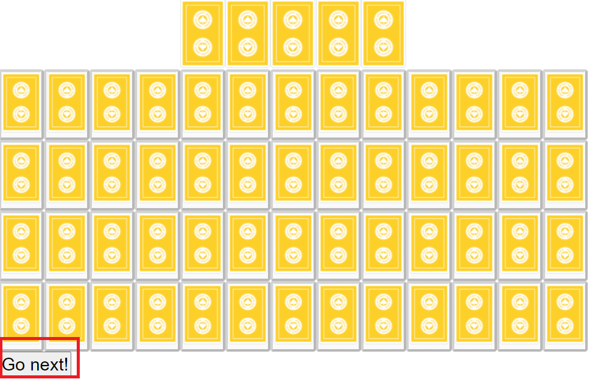
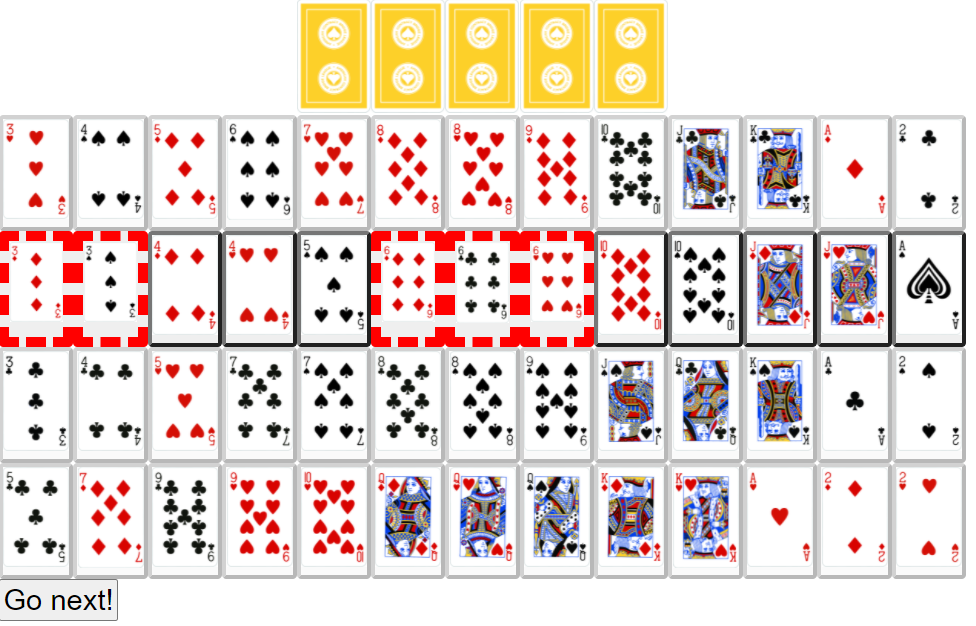
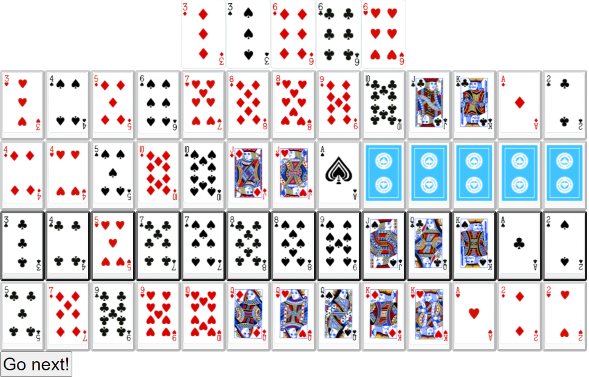
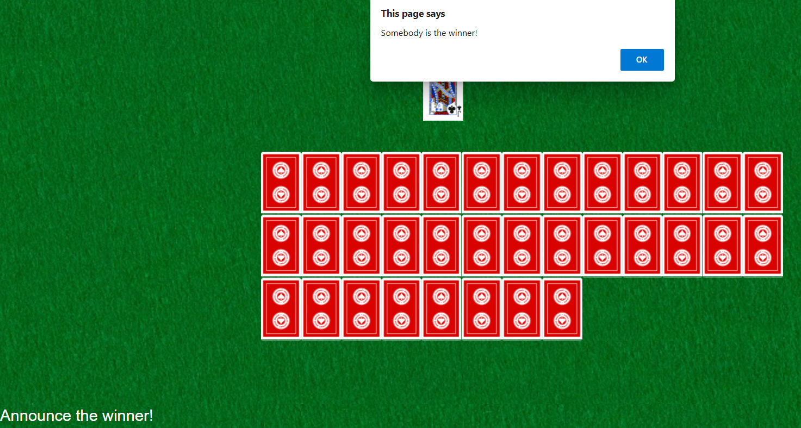

# Big Two

Big Two is a playing card game popular in Asia.
It's called Big 2 because 2 is the highest rank in the game.
The goal of the game is to play all of one's cards before the other players.

---

## This Project

This project allows one to play Big Two on [this](https://tabiosg.github.io/big-two/) website.

---

## How to Play

The website keeps track of the current state of the Big Two game.
In order to move onto the next state, one must press the "Go Next" button.
The button can be seen in the following image.



Picture 1: Starting screen with "Go Next" button highlighted

The next screen that one should see displays all 52 cards. This means that the cards have been dealt.
Every time the website is loaded, the cards will be distributed differently.
Each row represents each player and each of their cards (each player has 13 cards). The following image
shows the basic layout screen.


Picture 2: Basic layout screen, with each row representing a player's cards

The player whose turn it is can then select their cards. When ready, they can click the "Go Next" button.
If the selected cards do not form a valid hand, then the program will choose the action for them.
In this case, if the player is the first one placing cards on the table, then the program will make the
player play the lowest card. Otherwise, it will skip their turn. (Note that this functionality should be removed in the future
and was primarily only introduced to speed up the debugging process).
The following image shows the screen when the player selects their cards.



Picture 3: Selecting cards screen

Now, the table will display the best cards/hand played so far.
As seen in the following image, the best hand played so far will be shown on the top.



Picture 4: Best hand played so far being shown at the top of the screen

The game continues until someone no longer has any cards, in which case they are declared the winner. Once there is a winner,
an alert will pop up on the user's window as shown in the following image.



Picture 5: Winner alert pop up on the window screen

---

## How to Develop

Change the TypeScript code located in [```src/ts/```](src/ts/) in your favorite IDE. Then you can run ```npm run build``` to quickly update both TypeScript files and create the main.js file.

If you would instead like to do each step separately, you can do the following:
1. To update your TypeScript files into JavaScript, run ```npm run compile-typescript```.
This puts the compiled JavaScript files in [```src/js/```](src/js/).
2. To build your entire project, run ```npm run create-dist```. This creates [```main.js```](dist/main.js) which is called by [```index.html```](index.html).

If this is your first time using npm, you may need to run ```sudo apt install npm```, ```npm install typescript```, ```sudo npm install -g webpack```, and ```npm install```.

---

## Documentation

One can view the rules for the game [here](https://github.com/tabiosg/big-two/blob/main/rules/README.md).

One can view the source code documentation [here](https://github.com/tabiosg/big-two/blob/main/src/README.md).

---

## Work

Most of the work done for this project can be found in the [```src/ts/```](src/ts/) folder and in [```index.html```](index.html).
