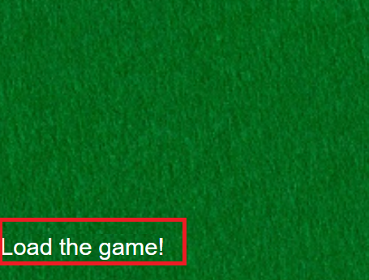
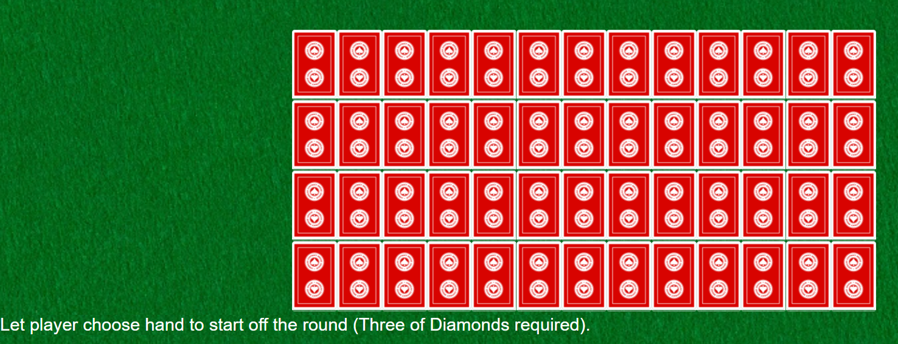
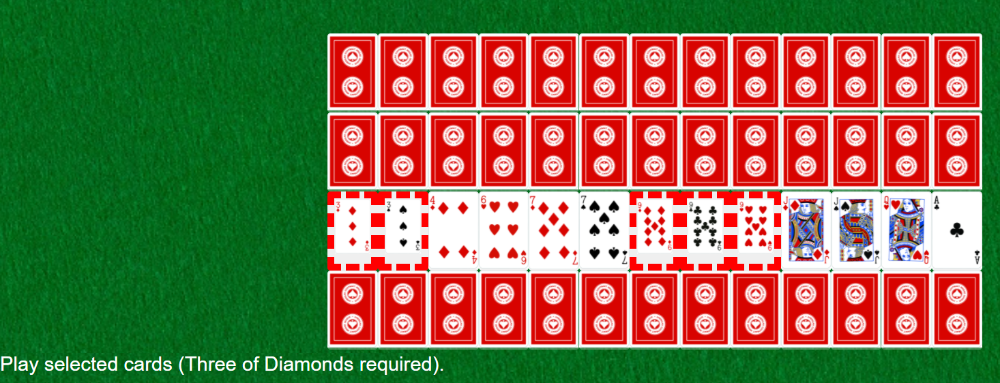
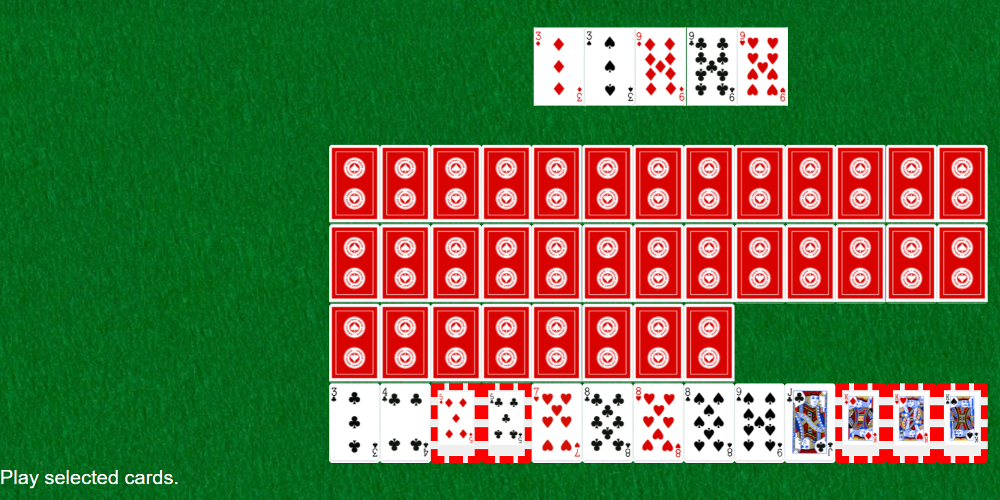

# Big Two

Big Two is a playing card game popular in Asia.
It's called Big 2 because 2 is the highest rank in the game.
The goal of the game is to play all of one's cards before the other players.

---

## This Project

This project allows one to play Big Two on [this](https://tabiosg.github.io/big-two/) website.

---

## How to Play

For debugging purpose, a red card represents the back of the card.
A blue card represents an empty slot. A yellow card represents the starting screen.

The website keeps track of the current state of the Big Two game.
In order to move onto the next state, one must press the "Go Next" button.
The button can be seen in the following image.



Picture 1: Starting screen with "Go Next" button highlighted

The next screen that one should see displays all 52 cards. This means that the cards have been dealt.
Every time the website is loaded, the cards will be distributed differently.
Each row represents each player and each of their cards. The following image
shows the basic layout screen.



Picture 2: Basic layout screen, with each row representing a player's cards

The player whose turn it is can then select their cards. When ready, they can click the "Go Next" button.
If the selected cards do not form a valid hand, then the program will choose the action for them.
In this case, if the player is the first one placing cards on the table, then the program will make the
player play the lowest card. Otherwise, it will skip their turn. (Note that this functionality should be removed in the future
and was primarily only introduced to speed up the debugging process).
The following image shows the screen when the player selects their cards.



Picture 3: Selecting cards screen

Now, the table will display the best cards/hand played so far.
As seen in the following image, the best hand played so far will be shown on the top.



Picture 4: Best hand played so far being shown at the top of the screen

The game continues until there is a winner. Once there is a winner,
an alert will pop up on the user's window as shown in the following image.


Picture 5: Winner alert pop up on the window screen

---

## How To Update the Project

If one wants to update the project, they can start by updating the .ts files.
Then, one can run ``` npm run build ``` on the terminal. Now, they can check
out the website by opening the index.html file.

---

## Documentation

One can view the rules for the game [here](https://github.com/tabiosg/big-two/blob/main/rules/README.md).

One can view the source code documentation [here](https://github.com/tabiosg/big-two/blob/main/src/README.md).

---

## Work

Most of the work done for this project can be found in the src/js file and in index.html.
