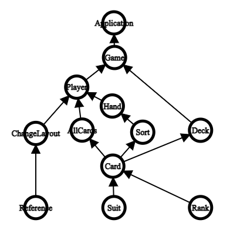
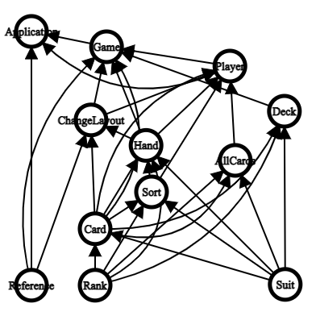

# Source Code Structure

This document explains the code structure of this project.

---

## All Files

All the source code is written in TypeScript then converted into Javascript by running ```npm run build``` in the terminal.

The files are the following: 

AllCards, Application, Card, ChangeLayout, Deck, Game, Hand, Player, Rank, Reference, Sort, and Suit.

Here is a simplified graph showing the general dependencies of all files.



Here is a chaotic graph showing which files require which.



---

## AllCards

AllCards imports Card, Rank, and Suit. It contains all 52 cards.

---

## Application

Application imports Game, Player, and Reference. It creates the Game object and adds in all the players.

---

## Card

Card imports Rank and Suit. It has the Card class definition and has the comparator functions.

---

## ChangeLayout

ChangeLayout imports Card, Hand, and Reference. It deals with changing the website appearance.

--- 

## Deck

Deck imports Card, Rank, and Suit. It has the Deck class definition and has shuffle, remove, add, and reset functions.

---

## Game

Game imports Player, Deck, Hand, Card, ChangeLayout, and Reference. It has the Game class definition and has all the functions needed for running a Big Two game.

---

## Hand

Hand imports Card, Rank, Suit, and Sort. It has the Hand class definition and all the functions needed to check if the Hand is valid or stronger than another hand.

---

## Player

Player imports Card, Sort, ChangeLayout, Hand, and AllCards. It has the Player class definition and all the functions allowing the player to manage their cards and deal hands.

---

## Rank

Rank has the Rank class definition and all the functions needed to create, get, and compare.

--- 

## Reference

Reference has all the information about the image components of the website and sets them on start.

---

## Sort

Sort imports Card, Rank, and Suit. It has the Card comparator functions that are used for sorting.

---

## Suit

Suit has the Suit class definition and all the functions needed to create, get, and compare.
